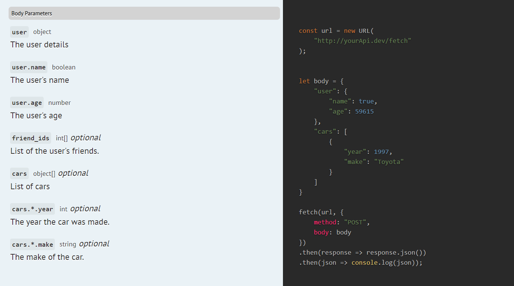

# Documenting body and file parameters for an endpoint
Scribe can get information about your endpoint's body parameters in two ways:
- the fully-manual way (using the `@bodyParam` annotation in JSDoc)
- the mostly-automatic way [coming soon]

## The manual way: Specifying body parameters with @bodyParam
To describe body parameters for your endpoint, use the `@bodyParam` annotation **when declaring the route**.

The `@bodyParam` annotation takes the type of the parameter, its name, an optional "required" label, and then its description. Valid types:
- `int` / `integer`
- `string`
- `number` / `float`
- `boolean`
- `array`, `object` (see [Handling array and object parameters](#handling-array-and-object-parameters) below)
- `file` (see [Documenting File Uploads](#documenting-file-uploads) below)

By default, Scribe will generate a random value for each parameter, to be used in the example requests and response calls. If you'd like to use a specific example value, you can do so by adding `Example: your-example-here` to the end of your description.

```eval_rst
.. Tip:: You can exclude a particular parameter from the generated examples by ending with `No-example` instead. The parameter will still be included in the text of the documentation, but it won't be included in response calls or shown in the example requests. [coming soon]
```

Here's an example:

```js
function createPost(req, res, next) {

}

/**
 * @bodyParam {int} user_id required The id of the user. Example: 9
 * @bodyParam {string} room_id The id of the room.
 * @bodyParam {boolean} forever Whether to ban the user forever. Example: false
 * @bodyParam {number} another_one This won't be added to the examples. No-example
 */
app.post('/posts', createPost)
```

```eval_rst
.. Important:: Remember to add the docblock on the route declaration, not the function declaration (:code:`createPost` in this case).
```

The body parameters will be included in the generated documentation text and example requests:


### Handling array and object parameters
Sometimes you have body parameters that are arrays or objects. To handle them in `@bodyparam`, Scribe follows this convention:
- For arrays: use a single field with type `<type of items>[]`
- For objects: you need a parent field with type `object` and an entry for each field, named with the dot notation `<parent name>.<field>`.
- For an array of objects, you need a parent field with type `object[]`, and an entry for each field, named with the dot notation `<parent name>.*.<field>`.


For instance, if your request body is in this form:

```json
{
  "user": {
    "name": "User's name",
    "age": 12
  },
  "friend_ids": [10, 23],
  "cars": [
    {
      "year": 1997,
      "make": "Toyota"
    }
  ]
}
```

you'd write:

```js
/**
 * @bodyParam {object} user required The user details
 * @bodyParam {string} user.name required The user's name
 * @bodyParam {number} user.age required The user's age
 * @bodyParam {int[]} friend_ids List of the user's friends.
 * @bodyParam {object[]} cars List of cars
 * @bodyParam {int} cars.*.year The year the car was made. Example: 1997
 * @bodyParam {string} cars.*.make The make of the car. Example: Toyota
 */
```




## Documenting file uploads [coming soon]
You can document file inputs by using `@bodyParam` or FormRequest rules with a type `file`. You can add a description and example as usual. 

For files, your example should be the absolute path to a file that exists on your machine. If you don't specify an example, Scribe will generate a fake file for example requests and response calls.

```js
/**
 * @bodyParam {string} caption The image caption
 * @bodyParam {file} image required The image.
 */
```

 

```eval_rst
.. Note:: Adding a file parameter will automatically set the 'Content-Type' header in example requests and response calls to `multipart/form-data`.
```
